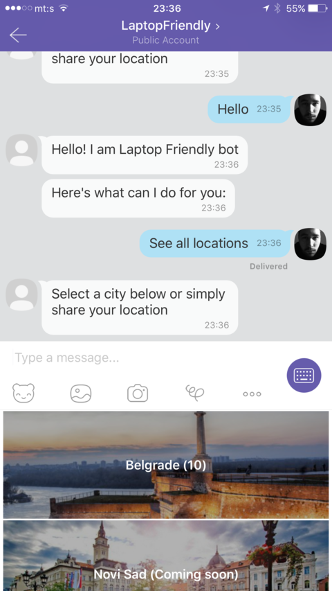

# Laptop Friendly Viber bot

Viber chatbot for [LaptopFriendly](https://laptopfriendly.co)

## Talk to the bot on Viber

Chatbot is available on [LaptopFriendly Public Account](http://viber.com/laptopfriendly) on Viber.

Just send Hi, or anything else.

If you are visiting this page from mobile, here's the deep link: [Hello, LaptopFriendly](viber://pa?chatURI=laptopfriendly&text=Hello).

## How it works

This chatbot was build with [Claudia Bot Builder](https://github.com/claudiajs/claudia-bot-builder) and it's connected to API.ai as an NLP/AI platform.

NLP is not customized yet, so the best way to interact with the bot is to use the buttons or simply to share your location and get the nearby recommendations.

## How it looks

